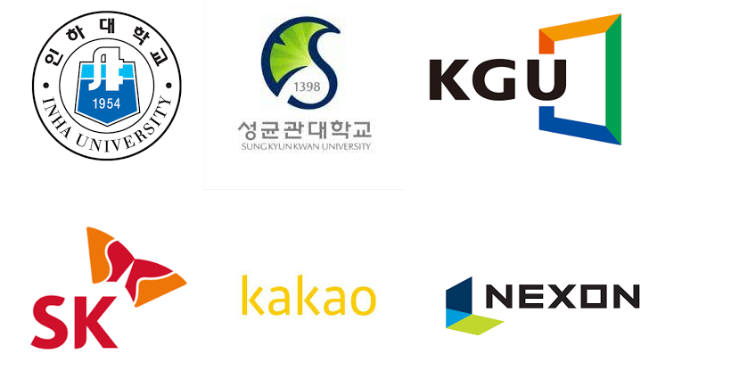
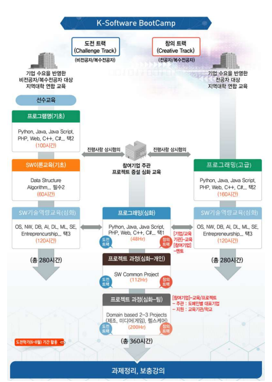

> 인하대학교에서 SW 개발에 관심있는 인재를 양성하고 현업 중심의 프로젝트를 경험할 수 있는 <K-Software BootCamp 2022>를 시작합니다

- 교육 참가를 원하시는 분들은 아래 커리큘럼 및 교육정보를 먼저 확인해주시고 이 [양식](https://forms.gle/1YajRhMu6BowCJsW6)을 제출해주세요. 지원서 검토 후 참가 여부에 대해 개별적인 연락을 드립니다.
- **2022년 7월 5일**까지 모집합니다.

## 다양한 대학 및 기업과 함께하는 프로젝트입니다.

- 본 교육은 <SW전문인재양성사업>의 일환으로 개설되는 교육 프로그램으로 3개 대학(인하대, 성균관대, 경기대)와 **SK, Kakao, Nexon 등 총 26개의 기업** 들을 중심으로 현장 중심 커리큘럼과 프로젝트가 구성되어 있습니다.
- 소프트웨어 중심 대학의 교육역량과 참여 기업들의 현업 지식을 통해 현장에서 적용가능한 실제 기술을 배우고 **SW개발자로 나아갈 수 있는 교육 프로그램**을 제공합니다.

## 프로그램 소개

- 본 프로그램은 총 640시간으로 구성되어 있으며 280시간은 **대학 연합으로 프로그래밍, SW 기술에 대한 교육**으로 360시간은 **참여기업 주관의 프로젝트 심화 과목**으로 구성되어 있습니다.

### 대학연합 개설과목

- 3개 **소프트웨어 선도 대학**(인하대, 성균관대, 경기대 - 소프트웨어 중심대학)에서 개설하는 실습 중심의 강좌를 통해, 프로그래밍 기술과 SW전반에 대한 지식을 쌓을 수 있습니다.
- 대학 연합에서 주관하는 SW 강좌는 크게 **`프로그래밍 기초`**, **`프로그래밍 심화`**, **`SW이론 기초`**, **`SW기술역량교육`** 으로 구성되어 있으며 하부 강좌들이 존재합니다.

<aside>
💡 각 강좌 내 세부 강좌들은 선택적으로 수강할 수 있는 구조를 통해, 개인의 개발 목적에 맞는 유연한 강의 수강이 가능합니다.

</aside>

#### 프로그래밍-기초

- SW개발에 입문하는 과정으로 SW개발에 사용되는 여러가지 언어들 중 가장 많이 사용되는 언어들에 대한 강의로 구성되어 있습니다.
- 프로그래밍-기초 커리큘럼을 이수하기 위해서는 최소 2과목의 선택과목을 수강하여야 합니다.

<table>
   <thead>
      <tr>
         <th>강좌</th>
         <th>필수</th>
         <th>강의소개</th>
      </tr>
   </thead>
   <tbody>
      <tr>
         <td>C#</td>
         <td>선택</td>
         <td>컴퓨터 프로그래밍의 기본이 되는 중요 개념들과 프로그래밍 언어가 가진 속성 및 구조를 소개한다 주요 내용으로는 데이터 형 데이터 제어 및 순서 제어 객체의 개념 효율적인 데이터 저장 및 환경 등으로 요약될 수 있다 또한 서로 다른 언어들 즉 명령적 언어, 논리적 언어 함수적 언어 객체지향적 언어의 특성과 응용 분야들을 간략히 살펴본다</td>
      </tr>
      <tr>
         <td>Python 프로그래밍</td>
         <td>선택</td>
         <td>파이썬 프로그래밍 언어는 다양한 분야에서 가장 인기있고 가장 많이 사용되는 언어이다. 파이썬 프로그램 개념과 활용하기 위한 원리와 개념을 배우고 이를 바탕으로 다양한 분야에 응용하는 실무적 방법을 교육한다.</td>
      </tr>
      <tr>
         <td>웹 프로그래밍</td>
         <td>선택</td>
         <td>웹 문서 작성에 사용되는 HTML 설계 및 응용을 다룬다 내용은 구조 표현 포맷 리스트, 링크 이미지 테이블 프레임 폼 등이 포함된다 이를 위해 소개 웹페이지 설계 , 형태 자바스크립트 멀티미디어 웹페이지 등을 소개한다.</td>
      </tr>
   </tbody>
</table>

#### SW이론교육-기초

- SW개발은 단순히 언어를 잘하는 것이 아니라 다양한 문제를 해결할 수 있는 능력이 중요합니다.
- SW이론교육에서는 여러가지 응용문제들을 해결하는 능력을 기르고 데이터를 다루는 세부적인 방법에 대해 배울 수 있습니다.
- SW이론교육-기초 커리큘럼을 이수하기 위해서는 2가지 필수 과목을 수강하여야 합니다.

<table>
   <thead>
      <tr>
         <th>강좌</th>
         <th>필수</th>
         <th>강의소개</th>
      </tr>
   </thead>
   <tbody>
      <tr>
         <td>알고리즘+자료구조</td>
         <td>필수</td>
         <td>본 과목의 목적은 컴퓨터 응용에서의 문제들을 풀기 위한 다양한 알고리즘과 알고리즘분석에 필요한 기본 법칙과 기술을 소개하는데 있다 컴퓨터 중심의 실제 문제들의 해결에 필요한 다양한 자료구조들의 사용법과 알고리즘 기술에 필요한 원칙과 기법에 대해서 소개하는 데 있다 본 과목에서 다루는 주제들로는 배열 스텍 큐 연결리스트 트리 ,그래프, 정렬, 해슁, AVL 트리 등으로 요약될 수 있다.</td>
      </tr>
      <tr>
         <td>데이터베이스</td>
         <td>필수</td>
         <td>데이터베이스 관리 시스템의 개념, ER디자인, 관계형 모델, 정규화기법, 계층형 모델, 망 모델 그리고 파일조직 등으로 요약될 수 있다</td>
      </tr>
   </tbody>
</table>

#### 프로그래밍-고급

- 프로그래밍-기초 와 SW이론교육-기초를 통해 다져진 지식을 기반으로 문제 해결중심의 프로그래밍을 배우게 됩니다.
- 각 언어들의 특성과 실제 프로그래밍 스타일을 배우며 SW개발자로 한걸음 더 나아갈 수 있습니다.
- 프로그래밍-고급 커리큘럼을 이수하기 위해서는 최소 2과목의 선택과목을 수강하여야 합니다.

<table>
   <thead>
      <tr>
         <th>강좌</th>
         <th>필수</th>
         <th>강의소개</th>
      </tr>
   </thead>
   <tbody>
      <tr>
         <td>C# Advanced 프로그래밍</td>
         <td>선택</td>
         <td>문제 해결 중심의 C#프로그래밍 전반에 대하여 실전이론과 다양한 문제 중심의 창의적 실습을 포함한 내용으로 문법적 이론이 필요한 부분에 대하여 간략히 설명을 수행하고 , 창의적인 해결 문제에 대하여 실습하며 학생들 스스로 개발을 완료한 후에, 실제 개발한 코드를 중심으로 설명하는 과정이다</td>
      </tr>
      <tr>
         <td>JAVA Advanced 프로그래밍</td>
         <td>선택</td>
         <td>심화된 자바 프로그래밍 수업으로 디자인패턴을 중심으로 현장에서 사용할 수 있는 다형성 기법을 습득하는 실무적 교육이다.</td>
      </tr>
      <tr>
         <td>Python Advanced 프로그래밍</td>
         <td>선택</td>
         <td>심화된 파이썬 프로그래밍 언어는 객체지향적인 프로그래밍을 파이썬을 이용하여 적용하고 인공지능 분야등 최신기술을 실무적으로 적용하는 방법을 교육한다.</td>
      </tr>
   </tbody>
</table>

#### SW기술역량 교육

- SW 개발은 여러가지 분야가 존재합니다. 현업에서 사용할 수 있는 기술을 배우기 위해 SW기술역량 교육은 여러가지 분야에 대한 이론 및 실습 강좌를 통해 현업 SW개발자가 되기 위한 준비를 도와줍니다.
- SW 기술역량 교육-심화 커리큘럼을 이수하기 위해서는 필수과목 2개와 최소 1과목의 선택과목을 수강하여야 합니다.

<table>
   <thead>
      <tr>
         <th>강좌</th>
         <th>필수</th>
         <th>강의소개</th>
      </tr>
   </thead>
   <tbody>
      <tr>
         <td>알고리즘+자료구조</td>
         <td>필수</td>
         <td>본 과목의 목적은 컴퓨터 응용에서의 문제들을 풀기 위한 다양한 알고리즘과 알고리즘분석에 필요한 기본 법칙과 기술을 소개하는데 있다 컴퓨터 중심의 실제 문제들의 해결에 필요한 다양한 자료구조들의 사용법과 알고리즘 기술에 필요한 원칙과 기법에 대해서 소개하는 데 있다 본 과목에서 다루는 주제들로는 배열 스텍 큐 연결리스트 트리 ,그래프, 정렬, 해슁, AVL 트리 등으로 요약될 수 있다.</td>
      </tr>
      <tr>
         <td>데이터베이스</td>
         <td>필수</td>
         <td>데이터베이스 관리 시스템의 개념, ER디자인, 관계형 모델, 정규화기법, 계층형 모델, 망 모델 그리고 파일조직 등으로 요약될 수 있다</td>
      </tr>
   </tbody>
</table>

### 참여기업 프로젝트

<aside>
💡 27개 참여기업(SK CC, Kakao, Nexon 등)의 현업 멘토들과 함께 실제 기업에서 직면하는 문제를 해결하고 프로젝트를 진행하며 현업 역량을 갖춘 SW 개발자로 거듭날 수 있습니다.

</aside>

- 프로젝트는 크게 **`스마트 팩토리`** **`헬스케어`** **`게임`** 로 구성되어 있으며 각 주제 아래 세부 주제들의 프로젝트가 존재합니다.
- 팀 구성별 난이도에 따라 2\~3개의 프로젝트를 선택하여 수행하며, 각 프로젝트당 60\~90시간 정도가 소요됩니다.

#### 스마트 팩토리

- 제조 산업을 주제로 SW개발을 수행하는 프로젝트로 **하드웨어 기반**, **소프트웨어 기반**, **디지털 트윈 기반** 의 프로젝트를 경험하고 현업 기술을 기를 수 있습니다.
- 스마트 팩토리 분야에서 개설되는 프로젝트는 아래 표와 같습니다.

<table>
   <thead>
      <tr>
         <th>프로젝트 명</th>
         <th>분류</th>
         <th>소개</th>
      </tr>
   </thead>
   <tbody>
      <tr>
         <td>IoT 오픈 플랫폼 기반 서비스</td>
         <td>기초</td>
         <td>IoT 시스템 연동을 위한 모듈을 구현하고 제조현장에서 사용되는 5 개 이내의 센서를 연결하여 표준화된 데이터를 수집하기 위한 서비스를 설계하고 실습을 학습함</td>
      </tr>
      <tr>
         <td>엣지 디바이스 연동</td>
         <td>기초</td>
         <td>LoRa 통신과 엣지 디바이스를 이용해 대규모 IoT 서비스를 구현하고, IoT 오픈 플랫폼 기반 제조 데이터 통합 서버를 구축하는 과정을 학습함</td>
      </tr>
      <tr>
         <td>데이터 지능화와 클라우드 시스템 연동을 위한 플랫폼 및 표준화</td>
         <td>기초</td>
         <td>데이터 표준화를 위해 주요 영향 인자 및 다양한 변수를 동시에 고려한 엣지-클라우드 시스템를 구축하는 과정을 학습함</td>
      </tr>
      <tr>
         <td>설비데이터 자동집계 및 실시간 의사결정을 위한 AI분석 기술</td>
         <td>응용</td>
         <td>스마트팩토리 구현으로 제조데이터 등을 활용하여 의사결정, 생산성 관리 등에 분석 기능을 구현하기 위한 이론과 실습을 학습함</td>
      </tr>
      <tr>
         <td>실시간 공장 및 설비 제어를 위한 스마트팩토리 구현</td>
         <td>응용</td>
         <td>스마트팩토리 구현으로 분석된 데이터를 활용하여 공장 제어, 이상치 검출 및 설비 예지보전 시스템을 구현하기 위한 이론과 실습을 학습함</td>
      </tr>
      <tr>
         <td>인공지능 스마트팩토리 구축</td>
         <td>현장실증</td>
         <td>인공지능 솔루션을 도입 및 적용하여 구축하는 인공지능 스마트팩토리를 구축하는 과정을 실제 환경에서 설계하고 이론과 실습을 학습함</td>
      </tr>
   </tbody>
</table>

#### 헬스케어

- 의료 산업 및 헬스케어 분야에서 요구되는 SW개발 기술을 배울 수 있으며, **임베디드 기반**, **클라우드 기반** , **모바일 기반 개인 서비스** 등의 프로젝트를 경험할 수 있습니다.
- 헬스케어 분야에서 개설되는 프로젝트는 아래 표와 같습니다.

<table>

   <thead>
      <tr>
         <th>프로젝트 명</th>
         <th>분류</th>
         <th>소개</th>
      </tr>
   </thead>
   <tbody>
      <tr>
         <td>임상 데이터 처리를 위한 데이터 분석</td>
         <td>기초</td>
         <td>임상실험 데이터 분석하기 위해 샘플링, 결측치 처리, 이상치 처리, 가설 검정, 채택 기각 의사결정, 혼동행렬을 통한 성과분석에 대한 이론 및 실습을 학습함</td>
      </tr>
      <tr>
         <td>생체신호 측정을 위한 IoT</td>
         <td>기초</td>
         <td>생체신호 측정을 위한 개념, IoT 센서의 종류 및 특징, IoT 플랫폼 구성 등 시제품 제작 이론 및 실습을 학습함</td>
      </tr>
      <tr>
         <td>기초 유헬스 서비스 구축</td>
         <td>기초</td>
         <td>유헬스 서비스 개념 파악을 위해, App에서 데이터를 전송하면, API 서버를 통해 DB에 저장되고 이를 Web에서 확인하는 과정을 통해 서비스 아키텍처의 이론 및 실습을 학습함</td>
      </tr>
      <tr>
         <td>의료데이터 처리를 위한 머신러닝</td>
         <td>응용</td>
         <td>의료 데이터를 분석하기 위해 데이터 (예 당뇨병) 를 수집하고 회귀분석, 의사결정나무, 신경망 등 다양한 기계학습 알고리즘의 이론 및 구현을 통해, 의료 머신러닝 과정을 학습함</td>
      </tr>
      <tr>
         <td>유전자 분석을 이용한 데이터마이닝</td>
         <td>응용</td>
         <td>유전자 데이터를 분석하기 위해, 유전자 데이터를 수집하고, 유전자분석 알고리즘의 이론 및 구현을 통해 유전자 분석 과정을 학습함</td>
      </tr>
      <tr>
         <td>의료 영상 분석을 위한 딥러닝</td>
         <td>응용</td>
         <td>의료 영상 데이터를 분석하기 위해 데이터를 수집하고 CNN의 Convolution, Pooling, Fully Connected Layer 의 이론 및 구현을 통해 의료 영상 딥러닝 과정을 학습함</td>
      </tr>
      <tr>
         <td>상호운영성 확보를 위한 의료 데이터 표준</td>
         <td>기초</td>
         <td>의료데이터의 용어 형식의 표준 체계를 학습하고, 비표준 데이터를 표준으로 변환 구현하고, 상호 검증하는 과정을 통해 의료데이터 연동을 학습함</td>
      </tr>
      <tr>
         <td>클라우드를 활용한 PHR 구축</td>
         <td>응용</td>
         <td>개인 건강 기록 서비스(personal health record, PHR) 구축을 위해 App에서 데이터를 전송하면, API DB서버를 통해 DB에 저장되고 이를 Web 에서 확인하는 과정을 통해 서비스 아키텍처의 이론 및 실습을 학습함</td>
      </tr>
   </tbody>
</table>

#### 게임

- 게임산업에서 많이 사용되는 프로그램의 실습과 사용을 통해 현업 역량을 양성할 수 있으며, **슈팅 게임**, **아케이드 게임**, **RPG 게임**, **퍼즐 게임**, **플랫폼** 등의 프로젝트를 경험할 수 있습니다.
- 게임 분야에서 개설되는 프로젝트는 아래 표와 같습니다.

<table>
   <thead>
      <tr>
         <th>프로젝트 명</th>
         <th>소개</th>
      </tr>
   </thead>
   <tbody>
      <tr>
         <td>언리얼 기반 게임 캐릭터 제작</td>
         <td>언리얼 엔진을 사용한 3D게임 개발을 통하여 언리얼 엔진 사용법과 개발 방법 습득</td>
      </tr>
      <tr>
         <td>C#기반 네트워크 활용 및 Unity 3D</td>
         <td>C# 기본문법을 시작으로 네트워크와 유니티 프로그래밍을 학습하는 과정으로 클라이언트 서버모델은 게임개발의 필수적인 지식으로 게임개발에 입문하기 위해서는 반드시 학습해야만 함. 소켓을 기반으로 한 서버프로그래밍의 기본 구조를 학습하고 나아가 서버 프로그래머로 성장하기 위한 기반을 만들기 위한 과정</td>
      </tr>
      <tr>
         <td>Unity 엔진을 활용한 게임 개발</td>
         <td>국내 개발사에서 대중적으로 활용하는 Unity엔진을 활용하여 게임개발에 대한 기본 지식을 배우고 해당 내용을 통한 프로젝트 구현 (C/C#)</td>
      </tr>
      <tr>
         <td>플래피 버드 2.5D 구현</td>
         <td>플래피 버드 아케이드 게임 구현을 통한 게임 실무 내용 학습</td>
      </tr>
      <tr>
         <td>MMORPG 개발</td>
         <td>C#과 유니티(Unity) 를 이용하여 유니티에서 제공하는 무료 에셋을 토대로 2D 게임을 만들어 볼 수 있도록 단계별로 필요한 기술을 학습</td>
      </tr>
      <tr>
         <td>Direct X를 이용한 게임엔진 개발</td>
         <td>데이터를 3D 그래픽으로 화면에 표현하는 여러가지 연산법과 엔진으로 쓸 수 있을 정도로 구조적으로 만드는 과정 학습</td>
      </tr>
   </tbody>
</table>

## 참여 혜택

<aside>
💡 강의 수강에만 집중할 수 있도록 셔틀 버스, 중/석식비 제공, 교육 지원금 제공 및 학점 인정

</aside>

- 교육 수강자 전부에게 중/석식비를 제공합니다.
- 교육장까지의 거리가 먼 경우를 위해 무료 셔틀버스 운행을 운행합니다.
- 교육 지원금을 제공하여 비용 걱정 없이 학습에만 집중할 수 있도록 최선의 지원을 아끼지 않습니다.

### [지원하기](https://forms.gle/1YajRhMu6BowCJsW6)
