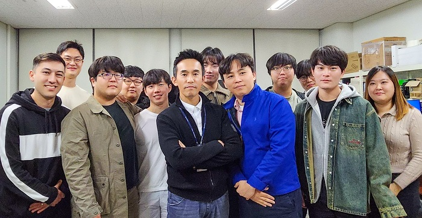

#### 인간과 컴퓨터 상호작용 연구실, 현장 경험 쌓은 맞춤형 인재 양성

컴퓨터공학과 권장우 교수의 인간과 컴퓨터 상호작용 연구실(Human Computer Interaction: HCI)이 LG전자 타깃랩(Target Lab)으로 선정됐다.

이번 선정으로 HCI연구실 소속 대학원생들은 타깃랩을 통해 현장 경험을 쌓고 LG전자 입사 희망 시 학위 취득 후 LG전자 추천 및 특별 채용과정에 응시할 수 있다.

LG전자 타깃랩은 산업체와 연구실의 지속적인 협업 및 교류를 통해 우수 인재를 확보하고자 시행되는 제도로, LG전자의 산학장학생 프로그램이다.

HCI연구실은 최근 인공지능을 이용한 대기오염망 이상 데이터 검출 및 열화상 데이터를 활용한 한국수력원자력 발전소 설비 이상 감지 프로그램 개발, 자율주행자동차 상황 인지 기술을 개발 중이다. 특히 LG전자와는 WebOS 임베디드 시스템에 탑재할 애플리케이션 개발 및 인공지능 엔진 등을 공동 연구한다.

권장우 컴퓨터공학과 교수는 “교수로서 가장 보람 있는 일 중 하나는 연구결과가 우리 실생활에 사용되는 제품에 적용되고 이를 연구한 학생들이 LG전자와 같은 좋은 직장에서 일하는 것이라 생각한다”라며 “단순히 논문에 그치는 연구가 아니라 산업체에서 필요로 하는 연구를 하는 산업체 맞춤형 미래 인재를 육성하겠다”라고 말했다.

[관련링크](https://www.inha.ac.kr/kr/952/subview.do?enc=Zm5jdDF8QEB8JTJGYmJzJTJGa3IlMkYxMSUyRjMyNjE0JTJGYXJ0Y2xWaWV3LmRvJTNGcGFnZSUzRDElMjZzcmNoQ29sdW1uJTNEYWxsJTI2c3JjaFdyZCUzRCVFQSVCNiU4QyVFQyU5RSVBNSVFQyU5QSVCMCUyNmJic0NsU2VxJTNEJTI2YmJzT3BlbldyZFNlcSUzRCUyNnJnc0JnbmRlU3RyJTNEJTI2cmdzRW5kZGVTdHIlM0QlMjZpc1ZpZXdNaW5lJTNEZmFsc2UlMjZwYXNzd29yZCUzRCUyNg%3D%3D)
